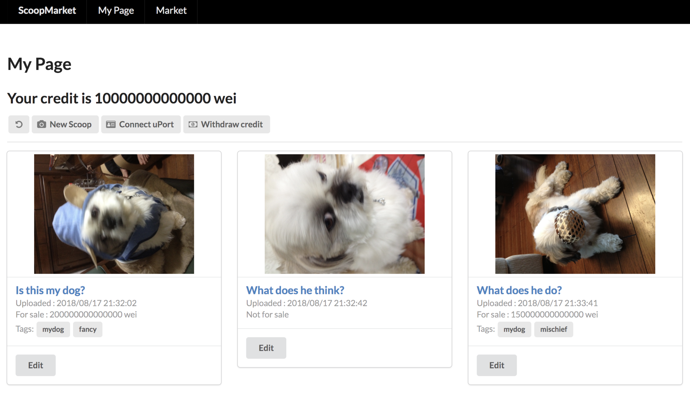

# ScoopMarket

## What does your project do?

A Market place for scoops.



"Scoops" means an existence of photo/videos.  
You can uplaod scoops securely on Blockchain and verify you own it.  
You also be able to trade them on market.

URL: https://ipfs.infura.io/ipfs/QmbshALcx92gsaeuLSkqdhXzw7uiLYunxurfFG5zBCd31L

The contract is deployed on Rinkeby.
So You need to connect test net by MetaMask, uPort or web3 enabled mobile browser such as Toshi or Cipher.

## How to set it up on local environment

0. You need to install following commands.

* truffle
* ganache-cli
* node/npm

1. Open terminal and run ganache-cli.

```sh
ganache-cli -i 1533140371286
```

2. Open other terminal window and run following commands.

```sh
npm install
truffle migrate
npm start
```

3. Open http://localhost:3000/ in browser.

## Development

This is a [re-frame](https://github.com/Day8/re-frame) application.

### Development Mode

#### Start Cider from Emacs:

Put this in your Emacs config file:

```
(setq cider-cljs-lein-repl
    "(do (require 'figwheel-sidecar.repl-api)
         (figwheel-sidecar.repl-api/start-figwheel!)
         (figwheel-sidecar.repl-api/cljs-repl))")
```

Navigate to a clojurescript file and start a figwheel REPL with `cider-jack-in-clojurescript` or (`C-c M-J`)

#### Run application:

```
lein dev
```

Figwheel will automatically push cljs changes to the browser.

Wait a bit, then browse to [http://localhost:3449](http://localhost:3449).

#### Run tests:

```
lein clean
lein doo phantom test once
```

The above command assumes that you have [phantomjs](https://www.npmjs.com/package/phantomjs) installed. However, please note that [doo](https://github.com/bensu/doo) can be configured to run cljs.test in many other JS environments (chrome, ie, safari, opera, slimer, node, rhino, or nashorn).

### Production Build

To compile clojurescript to javascript:

```
lein do clean, build
```

### Deploy to heroku

```
./deploy_heroku.sh
```

### Deploy to IPFS

You need local ipfs daemon.

```
ipfs daemon
```

Then deploy.

```
./deploy_ipfs.sh
```
